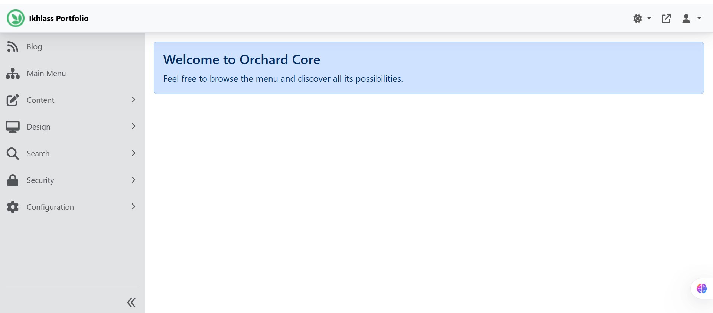
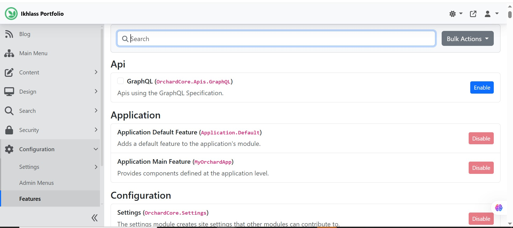
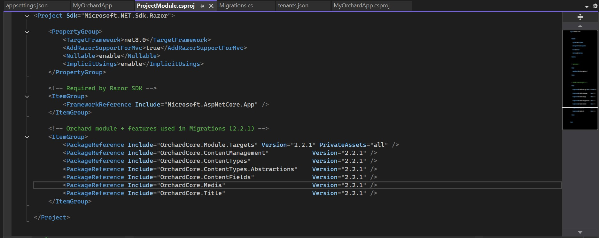

# ASP.NET Orchard Core Web Application

A modular web application built using **ASP.NET Core** and **Orchard Core CMS**, focusing on extensibility, clean architecture, and CMS-driven development.

---

## 🎯 Project Objective
Design and develop a scalable Orchard Core–based application with custom modules, content types, and role-based access control.

---

## ⚙️ Current Features (In Progress)
- Orchard Core CMS setup and configuration
- Custom module development (`ProjectModule`)
- Content types and content parts
- Admin dashboard configuration
- Role-based user and permission management
- Modular and feature-based architecture

---

## 🛠️ Technology Stack
- ASP.NET Core
- Orchard Core CMS
- C#
- Razor / MVC
- Database: SQLite (development)

---

## 📁 Project Structure

---

## ▶️ How to Run
1. Open the solution in **Visual Studio**
2. Restore NuGet packages
3. Run the application
4. Complete Orchard Core setup in the browser (first run)
5. Access the admin dashboard and manage content

---

## 🚀 Roadmap
- Add additional custom modules
- Build frontend pages driven by content types
- Improve UI structure and navigation
- Add deployment notes (IIS / Docker / Azure)
- Add screenshots and documentation

---
## 📸 Screenshots

### Orchard Admin Dashboard

### Custom Orchard Module Enabled

### Custom Orchard Module (Code)

---
## 📌 Notes
This project is under active development and will be extended progressively.

